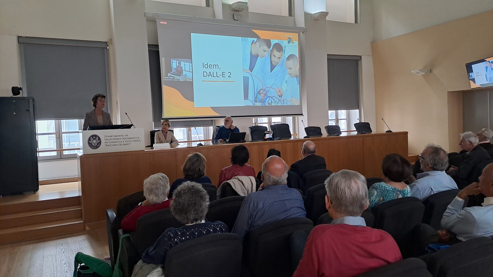

# Digital Divide: La Sfida Continua

Il 20 Aprile 2024, presso l'Aula Maga del Dipartimento di Ingegneria Informatica, Automatica e Gestionale “Antonio Ruberti” della Sapienza, in Via Ariosto 25, Roma
si è svolto il workshop conclusivo del progetto di Ateneo Terza Missione **"Un Computer per Tutti"** 

Un breve [presentazione](https://andreavitaletti.github.io/un_computer_per_tutti/slides.html) che illustra i risultati del progetto presentati nel workshop

## Link Diretta Stremaing

[Diretta su Youtube](https://youtube.com/live/i-0L-Wk5luc?feature=share)

## Registrazione Video dell'Evento

[Registrazione su Youtube](https://youtube.com/live/i-0L-Wk5luc?feature=share)

## Programma

|allineato al centro|allineato a destra|allineato a sinistra| 
|:---|:---|:---| 
|10:00 - 10:05|Saluti istituzionali  |Tiziana Catarci. (Sapienza)|
|10:05 - 10:30| Il Digital Divide di genere in ICT |Paola Velardi e Tiziana Catarci (Sapienza)|
|10:30 - 10:55|Il progetto “un computer per tutti”: un approccio data-driven alla comprensione del fenomeno del Digital Divide|Andrea Vitaletti (Sapienza)|
|10:55 - 11:20|La difficoltà di accedere ai servizi digitali della PA: un nuova forma di esclusione|Evelina Martelli (Comunità di Sant'Egidio)| 
|11:20 - 11:40 |Coffee break|| 
|11:40 - 12:05|Il Digital Divide negli istituti penitenziari|Carla Ciavarella (Dirigente - Dipartimento Amministrazione Penitenziaria - Ministero della Giustizia)| 
|12:05 - 12:40| L’impegno di ISF contro il Digital Divide|Maurizio Sapienza, Franco Visentin, Lorenza Pilloni, Armando Ferrauto (ISF| 
|12:40 - 13:05|Cloud Native Open Source: strategie per l'autonomia digitale e la riduzione del divario|Davide Lamanna (Binario Etico)| 
|13:05 - 13:30|Arginare il Digital Divide con la rigenerazione professionale di computer|Maori Rossi Fossati e Mario Miliucci (Reware) | 
|13:30 - 14:30|Pranzo|| 
| 14:30 - 16:00|Tavola Rotonda|Coordina Marco Temperini (Sapienza)| 

## Alcune foto dell'evento

